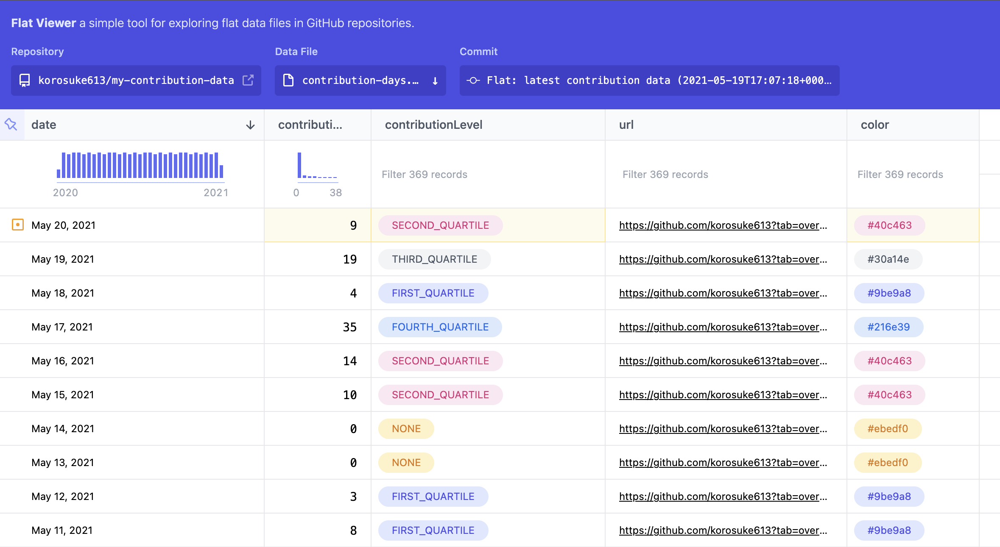
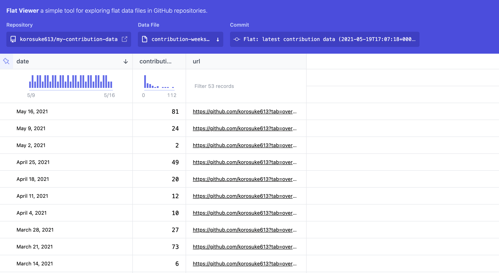

# my-contribution-data
This repository keeps track of the number of contributions I've made over the year. The recorded data can be viewed on [GitHub Flat Data](https://octo.github.com/projects/flat-data).

**[korosuke613/my-contribution-data – Flat](https://flatgithub.com/korosuke613/my-contribution-data?filename=contribution-days.json&sha=5155bd3b4cbef7725697617fa24efb2d77e659dc)**

## Contribution count of days

*https://flatgithub.com/korosuke613/my-contribution-data?filename=contribution-days.json*

## Contribution count of weeks

*https://flatgithub.com/korosuke613/my-contribution-data?filename=contribution-weeks.json*
